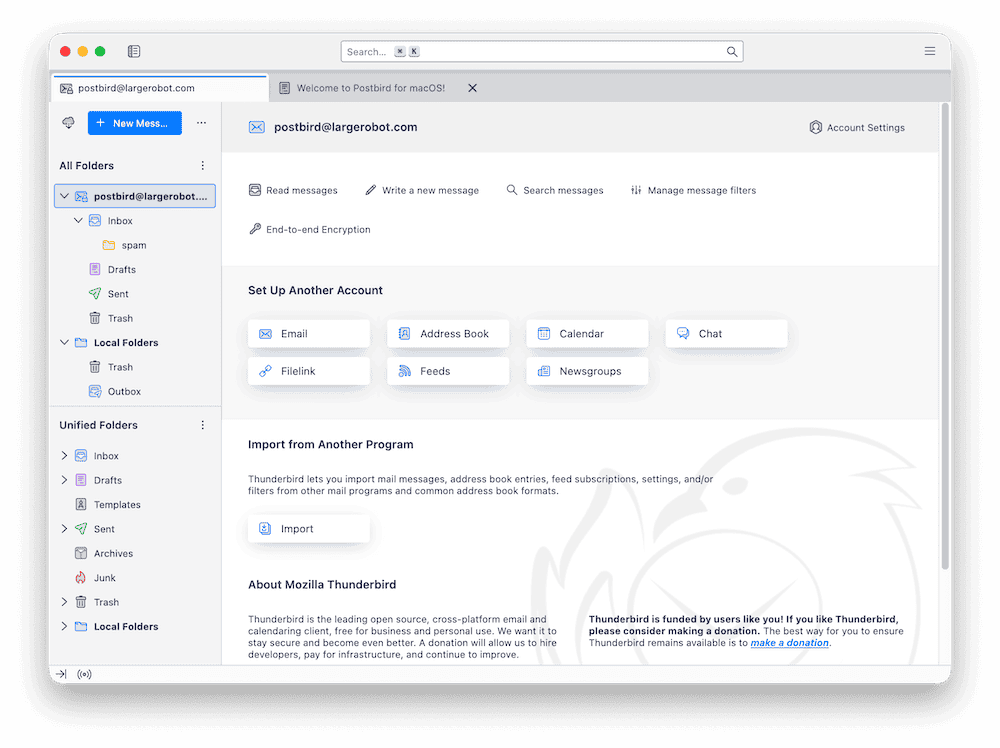
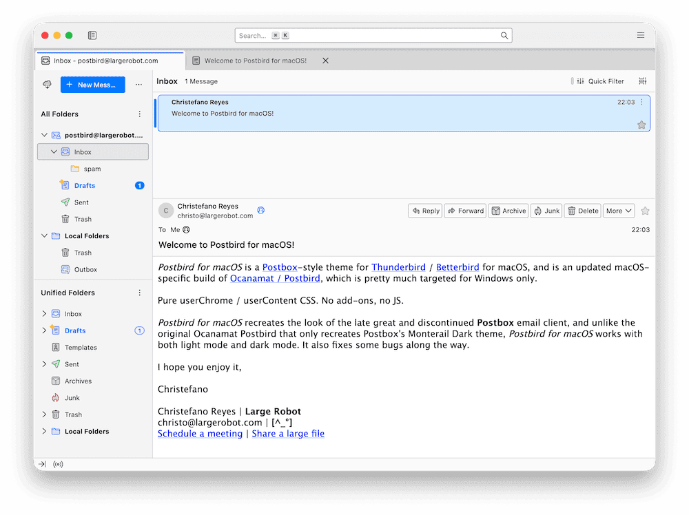
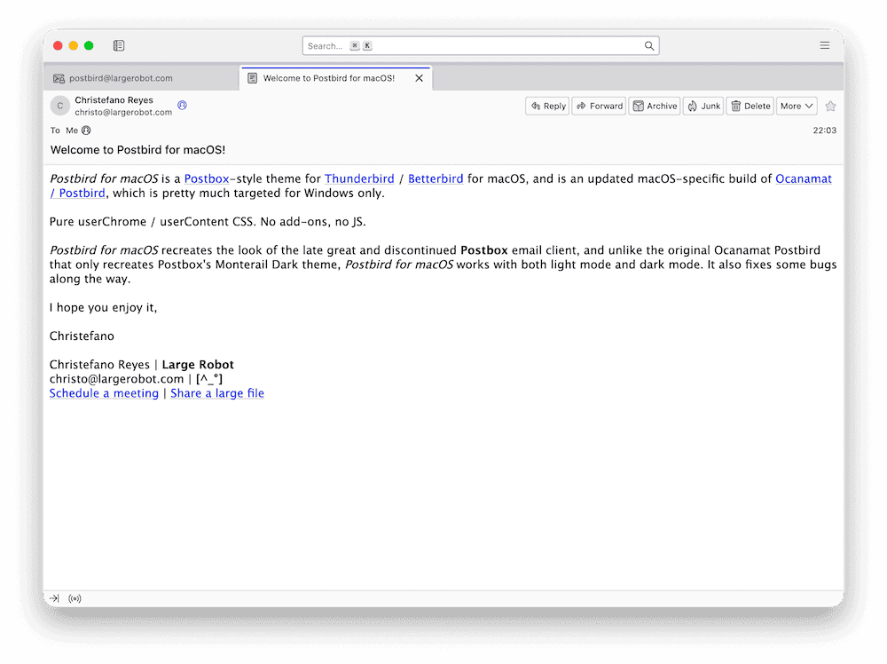
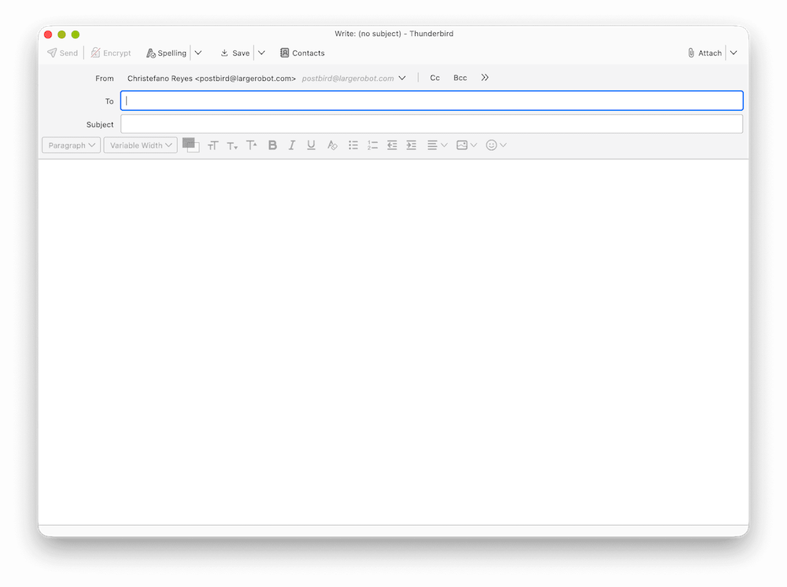
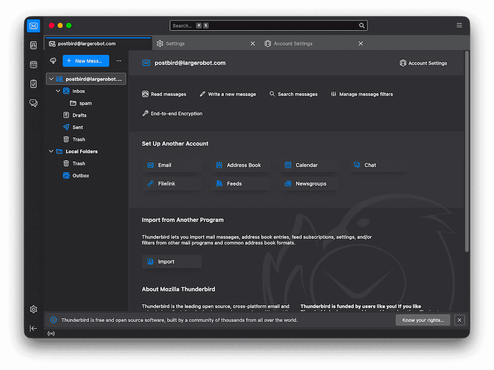
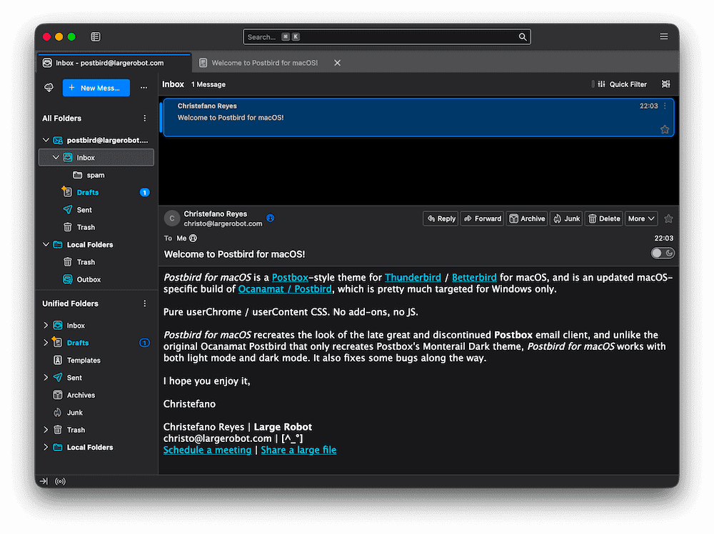
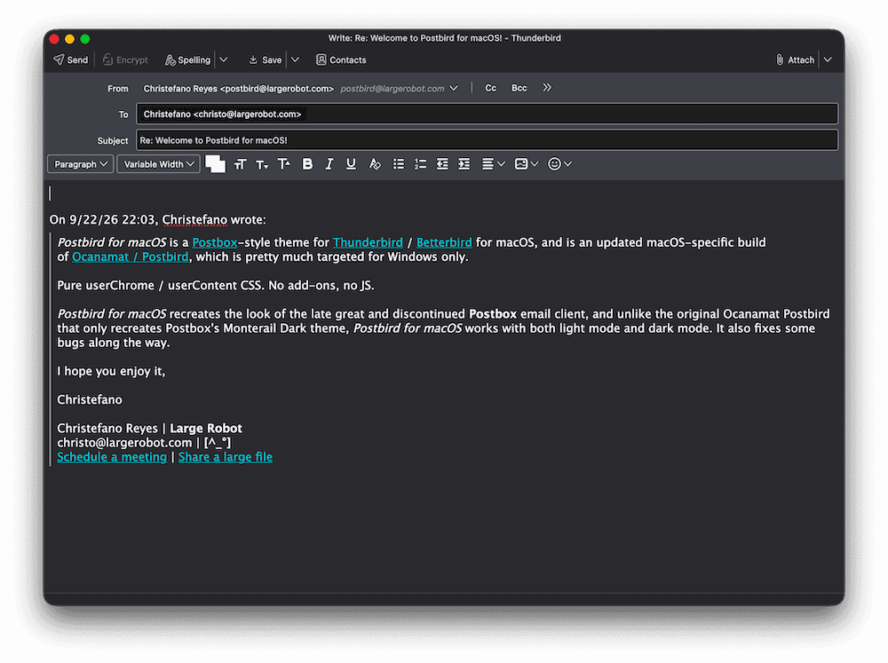
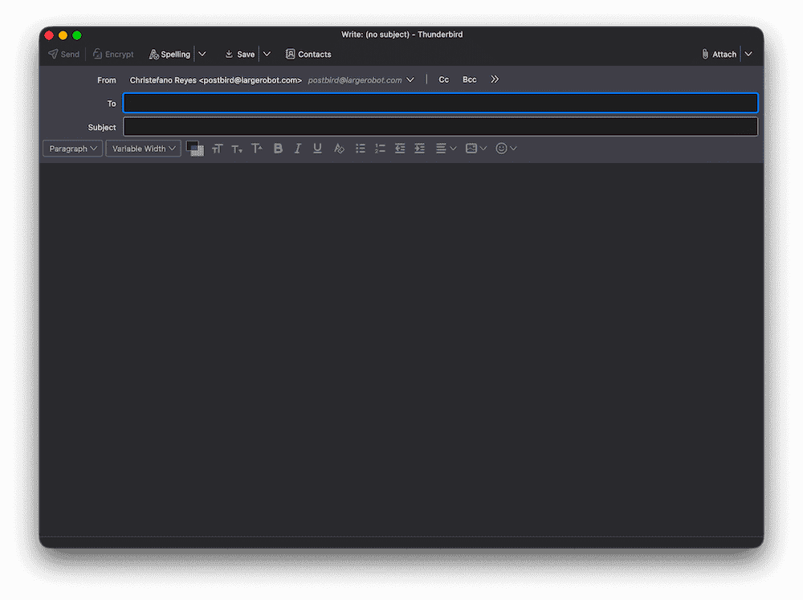

# Postbird for macOS

*Postbird for macOS* is a [Postbox](https://en.wikipedia.org/wiki/Postbox_(email_client))-style theme for [Thunderbird](https://www.thunderbird.net) / [Betterbird](https://www.betterbird.eu) for macOS, and is an updated macOS-specific build of [Ocanamat / Postbird](https://github.com/Ocanamat/Postbird), which is pretty much targeted for Windows only.

Pure `userChrome` / `userContent` CSS. No add-ons, no JS.

*Postbird for macOS* recreates the look of the late great and discontinued **Postbox** email client, and unlike the original Ocanamat Postbird that only recreates Postbox's Monterail Dark theme, *Postbird for macOS* works with both light mode and dark mode. It also fixes some bugs along the way.

*Postbird for macOS* is best used with **Betterbird 140.x ESR** (`140.12.0esr-bb24`), whose HTML thread tree needed fresh selectors.

## Screenshots

<table>
<tr>
<td align="center">

<em>Main window (light mode)</em>
</td>
<td align="center">

<em>Three-pane window (light mode)</em>
</td>
</tr>
<tr>
<td align="center">

<em>Message window (light mode)</em>
</td>
<td align="center">

<em>Compose message window (light mode)</em>
</td>
</tr>
</table>

<table>
<tr>
<td align="center">

<em>Main window (dark mode)</em>
</td>
<td align="center">

<em>Three-pane window (dark mode)</em>
</td>
</tr>
<tr>
<td align="center">

<em>Reply window (dark mode)</em>
</td>
<td align="center">

<em>Compose window (dark mode)</em>
</td>
</tr>
</table>

## Quick start

There's no installer. Copy the CSS to your Thunderbird / Betterbird profile, or:

1. Run this in Terminal:

```bash
# This all goes in your Thunderbird or Betterbird profile folder, usually:
# ~/Library/Thunderbird/Profiles/
# ~/Library/Application Support/Betterbird/Profiles/<profile>.default-release/

PROFILE=~/Library/Thunderbird/Profiles/<yours>.default-release
mkdir -p "$PROFILE/chrome"
cp -R chrome/postbird "$PROFILE/chrome/"
cp chrome/userChrome.css chrome/userContent.css "$PROFILE/chrome/"
```

2. Set `toolkit.legacyUserProfileCustomizations.stylesheets` to `true` in `about:config` (**Settings -> General -> Config Editor**).

3. Then start (or restart) Thunderbird / Betterbird.

The thread pane, folder pane, unified toolbar, tabs, message header, composer, status bar, and the email body all should now look like Postbox.

## Requirements

- Betterbird 140.x or Thunderbird on macOS
- `toolkit.legacyUserProfileCustomizations.stylesheets = true` in `about:config`

## Optional configuration

All the colors and sizes are `--pb-*` tokens in [`chrome/postbird/config.css`](chrome/postbird/config.css) and can be further editted and customized there.

## Betterbird-specific guidance

*Postbird for macOS* doesn't specifically support Betterbird, but it *should* work. Betterbird ESR updates its move selectors, so check [`docs/selector-map.md`](docs/selector-map.md) for Betterbird rules and [`docs/migration-runbook.md`](docs/migration-runbook.md) from the original Postbird project for more. Contributions welcome.

## Credits

- **[Ocanamat / Postbird](https://github.com/Ocanamat/Postbird)**, the original
  Windows / Betterbird theme this macOS build is derived and updated from. Much
  of the CSS design work is Ocanamat's, and this fork's changes are limited to
  the macOS install path and support for dark mode.
- **[Postbox](https://en.wikipedia.org/wiki/Postbox_(email_client))** and its
  Monterail Dark theme. Design inspiration only (no Postbox code or assets are
  included here).
- **[Betterbird](https://www.betterbird.eu)** and **[Mozilla Thunderbird](https://www.thunderbird.net)**
  — the client and upstream this themes.
- Community userChrome projects that informed the techniques here:
  **[aris-t2/customcssfortb](https://github.com/aris-t2/customcssfortb)**,
  **[rafaelmardojai/thunderbird-gnome-theme](https://github.com/rafaelmardojai/thunderbird-gnome-theme)**,
  and other Betterbird/Thunderbird userChrome themes shared by the community.

## License

[MIT](LICENSE)
